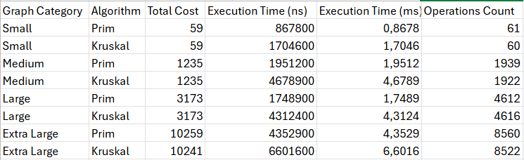

# Design and Analysis of Algorithms | Assignment 3
## City Network Optimization
### Minimum Spanning Tree: Prim vs Kruskal
Author: Symbat Saparbay from SE-2424
Repository in GITHUB:  [daa_assigment 3](https://github.com/peco220807/DAA_ASSIGNMENT3.git)
---
## Goal
This project aims to optimize urban transportation networks using two classic Minimum Spanning Tree (MST) algorithms — Prim’s and Kruskal’s.  
The assignment compares the algorithms in terms of execution time, operations performed, and efficiency on graphs of varying size and density.
---
## Algorithms Implemented

| Algorithm | Strategy | Data Structure | Complexity |
|-----------|---------|----------------|------------|
| Prim      | Grow MST from start vertex | Min-Heap (Priority Queue) | O(E log V) |
| Kruskal   | Pick edges greedily with cycle check | Union-Find (Disjoint Set) | O(E log E) |

Both algorithms ensure a connected MST with minimal total edge weight.
---
## Testing & Benchmarking
- **CorrectnessTest** verifies that both algorithms produce the same MST cost.
- **PerformanceTest** measures execution times and operation counts.
### Metrics Collected
1. MST total cost
2. Number of operations
3. Execution time (nano sec)
Results are exported to:
- `output.json` — detailed per-graph results
- `results.csv` — summary for tables or charts

---
# BONUS TASK RUNS IN MAIN AND OUTPUT ON TERMINAL
